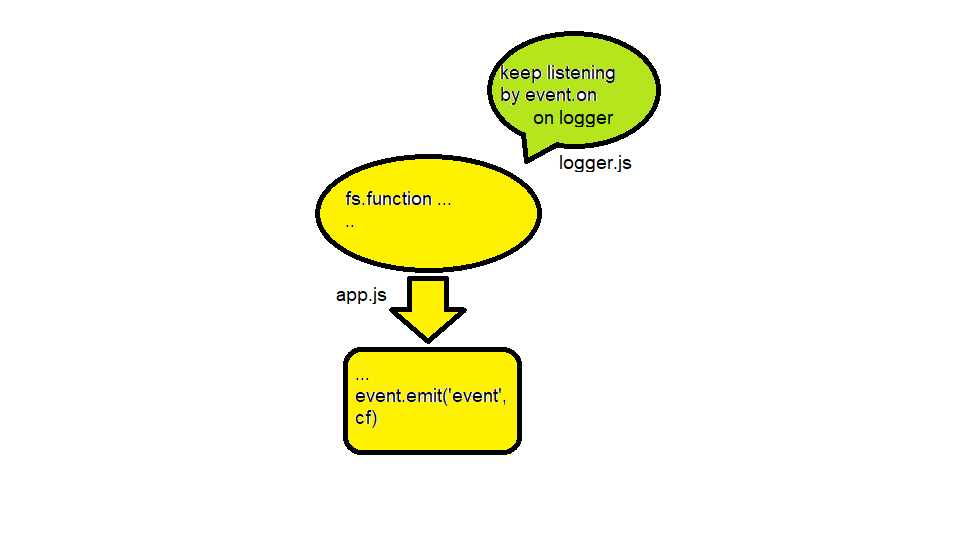

# LAB - Class 16

## Event-Driven

### Author: obada alquran

### Links and Resources

- [submission PR](https://github.com/obadeh/401-Event-Driven/pull/1)
- [ci/cd](http://xyz.com) (GitHub Actions)

### Setup

#### How to initialize/run your application (where applicable)

- e.g. `npm start`

#### Tests

- How do you run tests? `npm test`
- Any tests of note?
- Describe any tests that you did not complete, skipped, etc

#### UML

